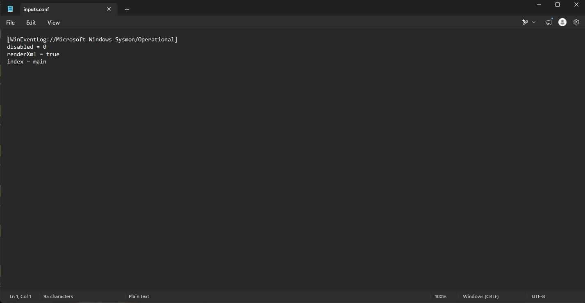

# 🛡️ SOC Lab – Sysmon Log Ingestion and Analysis with Splunk

## 📖 Project Overview

This project demonstrates a hands-on Security Operations Center (SOC) lab focused on collecting and analysing Windows endpoint telemetry using Sysmon and Splunk.

Sysmon was used to generate detailed Windows process and system activity logs. Splunk Universal Forwarder was then configured to send the Sysmon Operational event channel to Splunk Enterprise through receiving port 9997.

The project demonstrates endpoint log collection, forwarder configuration, Windows event ingestion, XML event analysis, and basic threat-detection workflows using Splunk.
## 🎯 Objectives

The primary objectives of this lab were to:

- Install and configure Splunk Enterprise on Windows.
- Enable Splunk to receive forwarded data on TCP port **9997**.
- Install and configure the Splunk Universal Forwarder.
- Forward the Sysmon Operational event channel to Splunk Enterprise.
- Verify the connection between the Universal Forwarder and Splunk.
- Confirm that Sysmon events were successfully indexed in `index=main`.
- Analyse raw Sysmon XML events in Splunk.
- Filter and investigate Sysmon Process Create events, including Event ID **1**.
- Build practical experience with endpoint telemetry, log ingestion, and basic SOC monitoring workflows.
## 🛠️ Technologies Used

| Category | Technology |
|----------|------------|
| Host Operating System | Windows 11 |
| Endpoint Telemetry | Sysmon |
| SIEM Platform | Splunk Enterprise |
| Log Forwarding | Splunk Universal Forwarder |
| Windows Log Source | Microsoft-Windows-Sysmon/Operational |
| Transport Port | TCP 9997 |
| Configuration | `inputs.conf` |
| Search Language | Splunk Processing Language (SPL) |
<a id="lab-architecture"></a>

## 🏗️ Lab Architecture

```text
Windows 11 Endpoint
        │
        │  Sysmon generates endpoint telemetry
        ▼
Microsoft-Windows-Sysmon/Operational
        │
        │  Collected by Splunk Universal Forwarder
        ▼
Splunk Universal Forwarder
        │
        │  TCP 9997
        ▼
Splunk Enterprise
        │
        ▼
Search, Filtering and Event Analysis
```
## 🖥️ Task 1 – Splunk Enterprise Setup

### Objective

Install Splunk Enterprise on Windows 11 and verify that the SIEM platform is accessible through the Splunk web interface.

### Activities Performed

- Installed Splunk Enterprise on the Windows 11 host.
- Created the Splunk administrator account.
- Confirmed that the installation completed successfully.
- Accessed Splunk through `http://localhost:8000`.
- Signed in and verified that the Splunk Enterprise home page loaded correctly.

### Skills Demonstrated

- Splunk Enterprise Installation
- Windows SIEM Setup
- Administrator Account Configuration
- Splunk Web Access
- Basic Service Verification

### Screenshots

#### Splunk Enterprise Installation Completed


#### Splunk Login Page


#### Splunk Enterprise Home Page


## 🔌 Task 2 – Configure Splunk Receiving Port

### Objective

Configure Splunk Enterprise to receive forwarded data from the Splunk Universal Forwarder.

### Activities Performed

- Opened **Settings → Forwarding and Receiving** in Splunk Enterprise.
- Configured a new receiving port.
- Enabled TCP port **9997** for forwarded event data.
- Verified that the receiving port was successfully created and active.

### Skills Demonstrated

- Splunk Receiver Configuration
- Forwarder-to-Indexer Communication
- TCP Port Configuration
- SIEM Data Ingestion Setup

### Screenshot

#### Receiving Port 9997 Enabled


## 📡 Task 3 – Splunk Universal Forwarder Setup

### Objective

Install the Splunk Universal Forwarder on Windows and configure it to send Sysmon event data to Splunk Enterprise.

### Activities Performed

- Installed the Splunk Universal Forwarder on Windows 11.
- Selected the **Local System** account for the forwarder service.
- Configured the receiving indexer as `127.0.0.1`.
- Set the receiving port to **9997**.
- Completed the forwarder installation successfully.
- Verified that the forwarder was connected to Splunk Enterprise.

### Skills Demonstrated

- Splunk Universal Forwarder Installation
- Windows Service Account Configuration
- Forwarder-to-Indexer Configuration
- Localhost Network Communication
- Log Forwarding Setup

### Screenshots

#### Local System Service Account Selection


#### Universal Forwarder Installation Completed


#### Receiving Indexer Connection Verified


## ⚙️ Task 4 – Sysmon Event Collection Configuration

### Objective

Configure the Splunk Universal Forwarder to collect events from the Sysmon Operational log and forward them to Splunk Enterprise.

### Activities Performed

- Opened the Splunk Universal Forwarder configuration directory:

  `C:\Program Files\SplunkUniversalForwarder\etc\system\local`

- Created an `inputs.conf` file.
- Added the Sysmon Operational event channel.
- Enabled XML rendering for detailed event information.
- Configured the events to be stored in the `main` index.
- Restarted the Splunk Universal Forwarder to apply the configuration.

### Configuration

```ini
[WinEventLog://Microsoft-Windows-Sysmon/Operational]
disabled = 0
renderXml = true
index = main
```

### Skills Demonstrated

- Splunk Input Configuration
- Sysmon Event Collection
- Windows Event Log Monitoring
- XML Event Rendering
- Universal Forwarder Configuration
- SIEM Log Ingestion Setup

### Screenshot

#### Sysmon `inputs.conf` Configuration


## 🔍 Task 5 – Verify Sysmon Log Ingestion

### Objective

Verify that Sysmon events are successfully forwarded by the Splunk Universal Forwarder and indexed in Splunk Enterprise.

### Activities Performed

- Opened **Search & Reporting** in Splunk Enterprise.
- Searched the `main` index for incoming events.
- Used an SPL query to identify the available event source.
- Confirmed that events were being received from:

  `WinEventLog:Microsoft-Windows-Sysmon/Operational`

- Verified that Sysmon events were indexed successfully.
- Opened raw XML events to inspect detailed process and network activity.

### SPL Queries

```spl
index=main
| stats count by source
| sort - count
```

```spl
index=main source="WinEventLog:Microsoft-Windows-Sysmon/Operational"
```

### Skills Demonstrated

- Splunk Search and Reporting
- SPL Querying
- Log Source Verification
- Sysmon Event Analysis
- Windows Endpoint Monitoring

### Screenshots

#### Sysmon Source Verification


#### Sysmon Events in Splunk


## 🧪 Task 6 – Sysmon Process Creation Investigation

### Objective

Generate and investigate a Sysmon Process Create event in Splunk using Notepad as the test process.

### Activities Performed

- Opened Notepad on the Windows 11 host to generate a new process event.
- Waited for the Sysmon event to be forwarded and indexed.
- Searched the Sysmon Operational source in Splunk.
- Identified the Notepad process inside the raw XML event.
- Confirmed that the event was recorded as Sysmon Event ID **1**.
- Reviewed process-related fields including:
  - Image
  - Process ID
  - Parent Process ID
  - Parent Image
  - Command Line
  - User
  - Hashes

### SPL Query

```spl
index=main source="WinEventLog:Microsoft-Windows-Sysmon/Operational"
| rex field=_raw "<EventID>(?<EventID>\d+)</EventID>"
| search EventID=1 "*notepad.exe*"
```

### Skills Demonstrated

- Sysmon Event ID 1 Analysis
- Process Creation Investigation
- SPL Field Extraction
- Raw XML Event Analysis
- Endpoint Activity Monitoring
- Basic Threat Hunting

### Screenshot

#### Notepad Process Creation Event in Splunk


## 🎓 Skills Demonstrated

- Splunk Enterprise Installation and Configuration
- Splunk Universal Forwarder Deployment
- Sysmon Event Collection
- Windows Endpoint Monitoring
- Windows Event Log Ingestion
- TCP Port 9997 Configuration
- `inputs.conf` Configuration
- SPL Querying
- Log Source Verification
- Raw XML Event Analysis
- Sysmon Event ID 1 Investigation
- Process Creation Monitoring
- SIEM Troubleshooting
- Basic Threat Hunting
- SOC Monitoring Workflow
## 📝 Key Takeaways

This project provided practical experience in collecting Windows endpoint telemetry, forwarding logs with the Splunk Universal Forwarder, and analysing Sysmon events in Splunk Enterprise.

The lab demonstrated a complete SOC monitoring workflow:

1. Install and configure Splunk Enterprise.
2. Enable receiving on TCP port 9997.
3. Install and configure the Splunk Universal Forwarder.
4. Configure Sysmon log collection through `inputs.conf`.
5. Verify successful log ingestion.
6. Investigate Sysmon Process Create events using SPL.

Completing this lab strengthened my understanding of SIEM architecture, Windows event monitoring, endpoint telemetry, log forwarding, SPL queries, and basic threat hunting.
